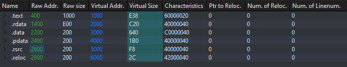
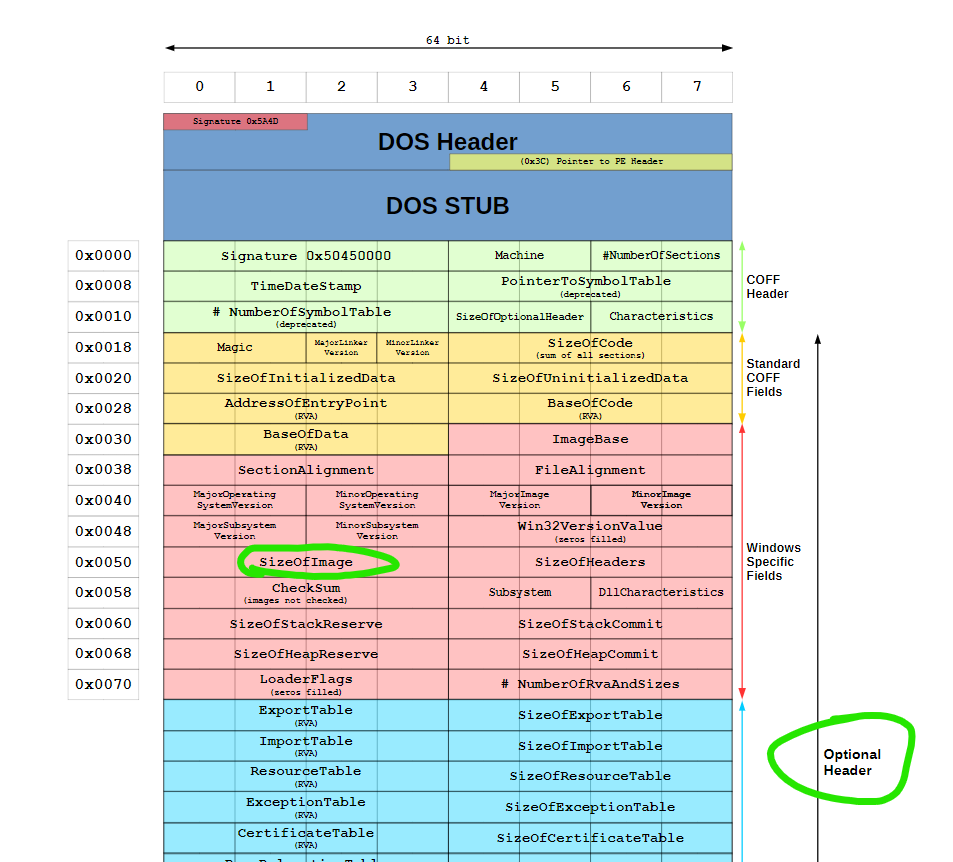
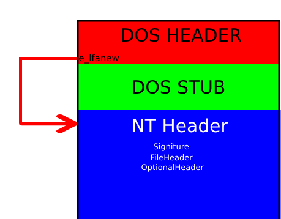
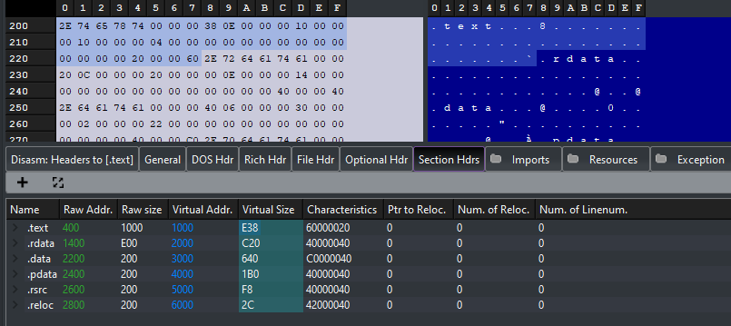
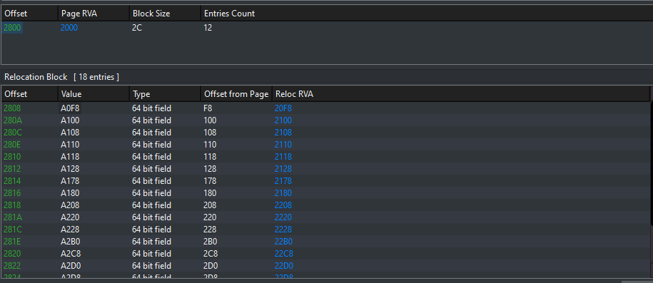
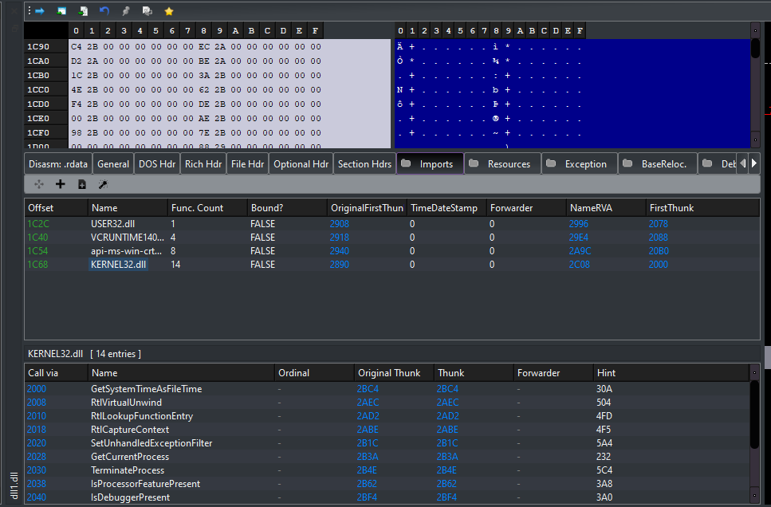

# Contents

- [What Is Manual Mapping?](#What-is-Manual-Mapping?)
- [Setup](#Setup)
- [PE File Format](#PE-File-format)
- [Mapping Sections](#Mapping-Sections-to-memory)
- [Handling Imports](#Handling-imports)
- [Executing TLS Callbacks](#Thread-Local-Storage-Callbacks)
- [Call DLL Main](#Call-DLL-MAIN!)
- [Resources](#Resources)

# What is Manual Mapping?
Manual Mapping injection is one technique for injecting DLL's into processes. This was very popular in the video game cheating scene. You are essentially emulating what [LoadLibary](https://learn.microsoft.com/en-us/windows/win32/api/libloaderapi/nf-libloaderapi-loadlibrarya) does at the bare minimum to get a DLL to run. This can be simplified into 5 steps:<br>
1. Mapping the DLL Sections into Memory
2. Handling Relocations
3. Handling Imports 
4. Execute TLS Callbacks (Thread Local Storage)
5. Call DLL Main

Steps 3-5 need to be carried out by injecting some shellcode into the remote process.

I found this a very confusing topic not long ago and would like to have a reference/guide that everyone can use when wanting to learn about manual mapping injection. If you want to code a manual map injector I suggest you get some background with the Windows PE format. InvokeRE have a very good video on this [here](https://www.youtube.com/watch?v=hzkuKducEqA). Guided Hacking also have a good video on the PE file format [here](https://www.youtube.com/watch?v=OkX2lIf9YEM) as well as there own [manual map injection tutorial](https://www.youtube.com/watch?v=qzZTXcBu3cE).


This will not provide the whole code but hopefully you will have a good enough understanding to write your own after this.

# Setup
First of all we need to open a handle to the process we want to inject into. To do this we must get the process id. We can use ```CreateToolhelp32Snapshot```, ```Process32First``` and ```Process32Next```. These will enumerate all the processes running including 64-bit processes. Below is the code to get a process id from the name of the process:
```c++
UINT getProcId(const char* name) {
    // Take snapshot of processes
	HANDLE hSnap = CreateToolhelp32Snapshot(TH32CS_SNAPPROCESS, 0);
	PROCESSENTRY32 pe32 = { 0 };
	
    // The size of the structure, in bytes. Before calling the Process32First function set this member to sizeof(PROCESSENTRY32). If you do not initialize dwSize Process32First fails.
    pe32.dwSize = sizeof(PROCESSENTRY32);

	// Check if there is a process in the structure
    if (!Process32First(hSnap, &pe32)) { return 0;  }

	do {
		std::string t(name);
		std::wstring procName(t.begin(), t.end());
        //Compare Process name to the name we want
    	if (!procName.compare(pe32.szExeFile)) {
			return pe32.th32ProcessID;
		}
	} while (Process32Next(hSnap, &pe32));
	
    return 0;
}
```
We now need to open a handle to the process we want to inject into.

You can see an example below of openning a handle to the process we want to inject into.
```c++
UINT procID = getProcId(exeName);
HANDLE hProc = OpenProcess(PROCESS_ALL_ACCESS, false, procID);
```

Now whats left to do for the set up is to load the DLL file into a buffer. You should already know how to do this but I am going to give the code so that further on in the explanation there is little confusion. 
```c++
std::ifstream infile(dllPath, std::ios::binary);

std::vector<BYTE> buffer((std::istreambuf_iterator<char>(infile)),std::istreambuf_iterator<char>());
```

# PE File format
After watching the two videos I linked at the start of the blog you should have a good understanding of what the PE file format looks like and how it is represented in memory. One resource I always look at when I strugge to visualise the PE format is this [Wikipedia Image](https://en.wikipedia.org/wiki/Portable_Executable#/media/File:Portable_Executable_32_bit_Structure_in_SVG_fixed.svg). If you struggle to understand why I may be doing some weird calculation or dont quite understand what is happening referring to this image will help.


# Mapping Sections to memory
You must map the sections of the DLL correctly in order for functions to be called correctly. If the sections are not loaded a their virtual addresses we will not be able to call functions or access data in the DLL. 

## What are sections?
Below shows an example of sections in a DLL. The ```.text``` section would hold code and the ```.rsrc``` section would hold resources that a PE file* uses. For example, this could be an image.


I like to think of sections as ordered information in the binary. It basically tells us where we can find certain values and data.

Now what does mapping sections entail? Essentially we need to load the raw data at the address of ```base address + virtual address```. The base address would be wherever we have allocated memory in the target process.

So lets allocate some memory in the target process!<br>
What do we need?
1. The handle of our target process.
2. The size of how large our DLL file is.
3. The DLL bytes that we have loaded into our buffer

<br>
Here we can see that the size of the image is located inside the optional header.

Well how can we get the optional header?<br>


Lucky for use the e_lfanew value holds an offset to the NT Headers which holds the optional header. Therefore all we need to do is add this value to the base address of our data.

Lets get this value
```c++
PIMAGE_DOS_HEADER pDosHeader = reinterpret_cast<PIMAGE_DOS_HEADER>(buffer.data());

PIMAGE_NT_HEADERS pNtHeader = reinterpret_cast<PIMAGE_NT_HEADERS> (buffer.data() + pDosHeader->e_lfanew);
```

Lets allocate the memory in the target process.
```c++
LPVOID pSrc = VirtualAllocEx(hProc, NULL, pNtHeader->OptionalHeader.SizeOfImage, MEM_COMMIT | MEM_RESERVE, PAGE_EXECUTE_READWRITE);
```

Now that we have the allocated memory we can start mapping our sections. We will need to iterate all the sections and write their raw data. The sections header will tell us all we need to know about a section.

The section header of each section is located in a contigous block of memory, meaning they are right next to each other. As ```.text``` in our earlier example was the 1st section the section header it would appear first and then ```.rdata``` section header would appear second. We can see this in PE-Bear.<br>


Clicking on the size we can see that .rdata section header appears right after .text.

By looking at the image we can see that the section header exists after the optional header. So what we will need to do is ```Address of NT header + Offset to Optional Header + Size of optional header```.

This is  defined by a macro called ```IMAGE_FIRST_SECTION```.
```c++
// IMAGE_FIRST_SECTION doesn't need 32/64 versions since the file header is the same either way.

# define IMAGE_FIRST_SECTION( ntheader ) ((PIMAGE_SECTION_HEADER)        \
    ((ULONG_PTR)(ntheader) +                                            \
     FIELD_OFFSET( IMAGE_NT_HEADERS, OptionalHeader ) +                 \
     ((ntheader))->FileHeader.SizeOfOptionalHeader   \
    ))
```

Therefore we can just use IMAGE_FIRST_SECTION to get first section header.
```c++
IMAGE_SECTION_HEADER* pSectionHeader = IMAGE_FIRST_SECTION(pNtHeader);
for (UINT i = 0; i != pNtHeader->FileHeader.NumberOfSections; i++)
	{
		if (pSectionHeader->PointerToRawData)
		{
			WriteProcessMemory(hProc, pAlloc + pSectionHeader->VirtualAddress, buffer.data() + pSectionHeader->PointerToRawData, pSectionHeader->SizeOfRawData, 0);
		}
		pSectionData++;
	}
```

As previously mentioned we are writing the sections data at the base address of our allocated memory in target process + virtual address of section.


Now you will probably want to write the PE header into the allocated memory. As we only have the sections. I will just use 0x1000 to write the first 1000 bytes into memory. 
```c++
WriteProcessMemory(hProc, pAlloc, buffer.data(), 0x1000, 0);
```
This is all you need for mapping the DLL sections into memory we now move onto handling relocations.
<br><br><i>*A PE file refers to the Portable Executable Format</i>
# Handling Relocations
This was hard for me to wrap my head around at the start but after messing around and reading loads of different blogs I finally understood it.

Essentially every PE file has a preferred location in memory they want to be loaded at. This is defined in ```IMAGE_OPTIONAL_HEADER.ImageBase```. If for whatever reason it is not loaded at the preferred image base we need to perform relocations.

Sometimes the compiler will make addresses absolute but very rarely this happens and therefore we need to update the base relocation table to reflect that the DLL has not been loaded at it's preferred image base.

The base relocation table is divided into blocks. Each block is any number of ```RELOCATIONENTRY_INFO``` structures.

The base reclocation table can be accessed from the Data Directory.

Therefore to get the base relocation table we just need to:
```c++
const IMAGE_BASE_RELOCATION* baseRelocDirectoryEntry = reinterpret_cast<PIMAGE_BASE_RELOCATION>(reinterpret_cast<DWORD_PTR>(mp->baseAddress)
+ ntHeader->OptionalHeader.DataDirectory[IMAGE_DIRECTORY_ENTRY_BASERELOC].VirtualAddress);
```

Each relocation block has an entry which can be defined in this structure.
```c++
typedef struct {
	WORD offset : 12;
	WORD type : 4;
} RELOCATIONENTRY_INFO;
```

Now we want to know how many relocations we want to perform in each block. <br>


The above image shows a relocation table alongside a relocation block. 

To calculate how many relocations we need to perform the calculation is:
```
const UINT relocCount = (baseRelocDirectoryEntry->SizeOfBlock - sizeof(IMAGE_BASE_RELOCATION)) / sizeof(RELOCATIONENTRY_INFO);
```

Now this looks really confusing but it is actually quite simple to understand.

As you can see in the image from PE bear the offset is 2800 but in the relocation block the first entry offset is 2808. This is because the block has it's own 8 bytes that are used to describe itself. The SizeOfBlock member includes these 8 bytes. Therefore we need to subtract those 8 bytes. Each entry is 2 bytes (16 bits). Therefore we can simplify this to ```0x2c - 0x8 / 2```. This will give us 18 which is exactly the number of entries.

Now you can begin to understand what we are building up we will have a loop looping through each block of relocations and another loop looping through the relocations in each block.

Here is some pseudo code that might help.
```
for relocation_block:
    for relocation_in_block:
        perform relocation
```

For each relocation in the block we need to find out it's type so that we can handle it. All these types are defined by Microsoft [here](https://www.rotta.rocks/offensive-tool-development/windows-internals/pe-file-format/pe-base-relocations#:~:text=The%20Base%20Relocation%20Table%20is,any%20number%20of%20offset%20entries). In my DLL file there is only ```IMAGE_REL_BASED_DIR64``` we need to handle. We can tell this as the first letter in the value is A which in hexadecimal is 10.

Microsoft tells us that for ```IMAGE_REL_BASED_DIR64``` <i>The base relocation applies the difference to the 64-bit field at offset.</i> Essentially we apply the difference between our current image base and the preferred image base. This is commonly referred to as the delta.

```c++
imageDelta = baseAddress - ntHeader->OptionalHeader.ImageBase;
```

We then apply this delta to the offset.

We have now handled relocations! Onto handling PE imports.

# Handling imports
Most PE files will need to import other files. For example you may have heard of Kernel32.dll. There is a import table which you may have heard of before which describes all imports.


<br>
Essentially there are 3 things we want to do:
1. Load the import using loadlibary
2. Update FirstThunk for each entry

To load the import using loadlibary all we need to do is get the name of the file to import from the import descriptor. An example can be seen below:
```c++
PIMAGE_IMPORT_DESCRIPTOR pImportDescriptor = reinterpret_cast<PIMAGE_IMPORT_DESCRIPTOR>(reinterpret_cast<DWORD_PTR>(mp->baseAddress) + ntHeader->OptionalHeader.DataDirectory[IMAGE_DIRECTORY_ENTRY_IMPORT].VirtualAddress);
while (pImportDescriptor->Name)
	{
		// Get the name of the libary to load
		char* importName = reinterpret_cast<char*>((DWORD_PTR)(mp->baseAddress) + pImportDescriptor->Name);
		HINSTANCE loadedImport = _LoadLibaryA(importName);
	}
```

Now what are OriginalFirstThunk and FirstThunk?

#### OriginalFirstThunk
This is a field in the Import Directory Table that points to an array of ```IMAGE_THUNK_DATA``` structures. This array is often referred to as the Import Name Table. It holds the names (or ordinals) of the functions that need to be imported. Each entry in this array initially points to a structure (IMAGE_IMPORT_BY_NAME) that contains the name of an imported function. During the loading of the PE file, the loader uses this table to resolve the addresses of the imported functions.

#### FirstThunk
This is another field in the Import Directory Table that points to an array of ```IMAGE_THUNK_DATA```structures, but this array is often referred to as the Import Address Table (IAT). It is used by the loader to store the actual addresses of the imported functions. Initially, this array may contain the same information as the OriginalFirstThunk array. After the loader resolves the addresses of the imported functions, it overwrites these entries with the actual addresses. This table is used by the executable at runtime to call the imported functions.

You can simply just do this by calling GetProcAddress and updating the Func.

```c++
DWORD64* pThunk = reinterpret_cast<DWORD64*>(reinterpret_cast<DWORD_PTR>(mp->baseAddress) + pImportDescriptor->OriginalFirstThunk);
DWORD64* pFunc = reinterpret_cast<DWORD64*>(reinterpret_cast<DWORD_PTR>(mp->baseAddress) + pImportDescriptor->FirstThunk);

// If pThunk not defined we just use first thunk
if (!pThunk) { pThunk = pFunc; }

	for (; *pThunk; ++pThunk, ++pFunc)
		{
			auto* pImageImportByName = reinterpret_cast<IMAGE_IMPORT_BY_NAME*>(reinterpret_cast<DWORD_PTR>(mp->baseAddress) + *pThunk);
					*pFunc = _GetProcAddy(loadedImport, pImageImportByName->Name);
		}
		++pImportDescriptor;
```

# Thread Local Storage Callbacks
These callbacks are used to perform initialization and cleanup tasks for resources that are specific to individual threads. For example, if an application needs to allocate and initialize thread-specific data, it can do so in a TLS callback.

Interestingly TLS callbacks are used in malware to execute code before the Main function so that they are not detected by the debugger. See [here](https://attack.mitre.org/techniques/T1055/005/).

These are located in the Data Directory and it's pretty simple to invoke these.
How to invoke these is defined [here](https://learn.microsoft.com/en-us/windows/win32/debug/pe-format#tls-callback-functions)

```c++
if (ntHeader->OptionalHeader.DataDirectory[IMAGE_DIRECTORY_ENTRY_TLS].Size)
{
	auto* pTLS = reinterpret_cast<PIMAGE_TLS_DIRECTORY>((DWORD_PTR)(mp->baseAddress) + ntHeader->OptionalHeader.DataDirectory[IMAGE_DIRECTORY_ENTRY_TLS].VirtualAddress);
	auto* pCallback = reinterpret_cast<PIMAGE_TLS_CALLBACK*>(pTLS->AddressOfCallBacks);

	for (; pCallback && *pCallback; ++pCallback)
	{
		(*pCallback)(mp->baseAddress, DLL_PROCESS_ATTACH, nullptr);
	}
}
```
# Call DLL MAIN!
Now you have handled everything to manually map a DLL into a process.

To call DLL main it is located at the entry point inside the OptionalHeader.

```c++
using DllMainPtr = BOOL(__stdcall*)(HINSTANCE hinstDLL, DWORD fdwReason, LPVOID lpvReserved);
const auto DllMain = reinterpret_cast<DllMainPtr>(
	reinterpret_cast<DWORD_PTR>(baseAddress) +
	ntHeader->OptionalHeader.AddressOfEntryPoint);

DllMain(reinterpret_cast<HINSTANCE>(mp->baseAddress), DLL_PROCESS_ATTACH, nullptr);
```

## Extra Notes
Steps 1-3 inside shellcode are written into the process and called through CreateRemoteThread. However, we need to write position independant code. Therefore, when passing the base address,locations of LoadLibary and GetProcAddress it can be useful to use a structure that is also written into the target processes memory and the location is passed as an argument to CreateRemoteThread. 

To debug your shellcode it can also be useful to return codes at certain parts so you can tell where you are going wrong. Below is an example.

Inside our manual mapper:
```c++
HINSTANCE hCheck = 0;
while (!hCheck) {
	MANUALMAPDATA data_check = { 0 };
	ReadProcessMemory(hProc, AllocatedMappingDataLocation, &data_check,sizeof(data_check), 0);
	hCheck = data_check.hMod;
	if (hCheck == (HINSTANCE)0x404)
	{
		std::cout << "No mapping data \n";
	}
}
```
Inside Shellcode:
```c++
void __stdcall ManualMap(MANUALMAPDATA* mp)
{
	if (!mp) {
		mp->hMod = (HINSTANCE)0x404;
		return;
	}
}
```

## Resources
[0xRick - Windows Internals Blogs](https://0xrick.github.io/)<br>
[Guided Hacking - Manual Mapper Youtube Series](https://www.youtube.com/watch?v=qzZTXcBu3cE)<br>
[Code Reversing Manual Mapping](https://www.codereversing.com/archives/652)<br>
[End Of Entropy - Manual Map Github](https://github.com/EndOfEntropy/DLL-Manual-Mapping/tree/master)<br>
